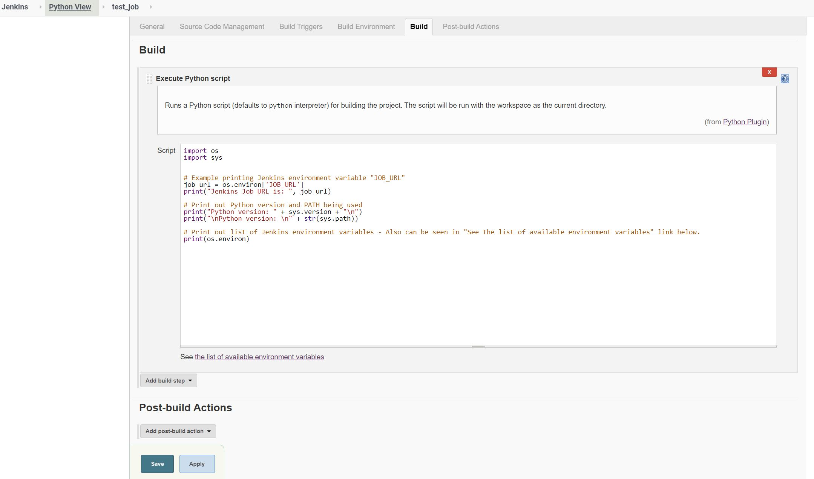

# Python plugin for Jenkins

[](https://plugins.jenkins.io/python)  
[](https://plugins.jenkins.io/python)  

Adds the ability to execute Python scripts as build steps.  Jenkins environment variables can also be utilized in the script as described below.  
**Note**: It is expected that the Python interpreter is available on the system PATH.  

## Usage  
1. After installing the plugin, go to the job configuration page and select "Execute Python Script" from the "Add build step" drop down menu.  
2.  Enter Python code.  Note that this defaults to the systems "python" interpreter.  The below Python code can be used to see what this is.  
```python
import sys

print("Python version: " + sys.version + "\n")
print("Python Path: \n" + str(sys.path))
```
## Example with Jenkins Environment Variable  
If needed, Jenkins environment variables can be assigned to a Python variable as follows:  
```python
import os

job_url = os.environ['JOB_URL']
print("Jenkins Job URL is: ", job_url)
```

## Note on Python 3 - Linux  
Many Linux distributions have "python" set to Python 2 as default.  This can be changed to Python 3 as shown below.  
**Note**:  These commands are set system wide and will effect all users.  This is currently required for this plugin.   
**Note if using Node**:  These commands will need to be run on the respective node.  
```
# Use below to see "python" and "python3" versions.
python --version
python3 --version

# If no python3 version is present, install the desired Python 3 version
# Example with Python 3.7
sudo apt update
sudo apt install python3.7 -y

# Show python versions available 
ls /usr/bin/python*

# Check if any Python alternatives exist
update-alternatives --list python
# If a Python 3 alternative is shown that you would like to use, you can use the "sudo update-alternatives --config python" command to select it.
# If none exist this will result in following error: update-alternatives: error: no alternatives for python

# If no alternatives are present, create one for the respective Python 3 version - Python 3.7 used in this example:
sudo update-alternatives --install /usr/bin/python python /usr/bin/python3.7 1

# python --version should now show Python 3.7

# Optional: If needed, another alternative such as "python2" could be created to allow use of Python 2 on the system as follows:
sudo update-alternatives --install /usr/bin/python python2 /usr/bin/python2.7 1
# "python2 --version" should now show Python 2 version.  Then "python2" can be used to run Python 2 scripts or interpreter.
```

## Note on Python 3 - Windows  
Python 3 gives the option on Windows to install the "Python Windows Launcher" which is called with the "py" command.  
This plugin does not currently support this, as it is only calling "python" to load the interpreter.  

Issue can arise if both Python 2 and Python 3 are added to the system PATH as both versions use the same name for the executable - "python.exe", in which case Python 2 is generally called.  
A quick workaround would be to remove Python 2 from the system PATH.  Python 2 could still be used outside Jenkins by creating a Python virtual environment or using a package such as [pyenv-win](http://example.com) to manage Python versions. 

## Screenshots


## Release Notes

See [GitHub Releases](https://github.com/jenkinsci/python-plugin/releases).
